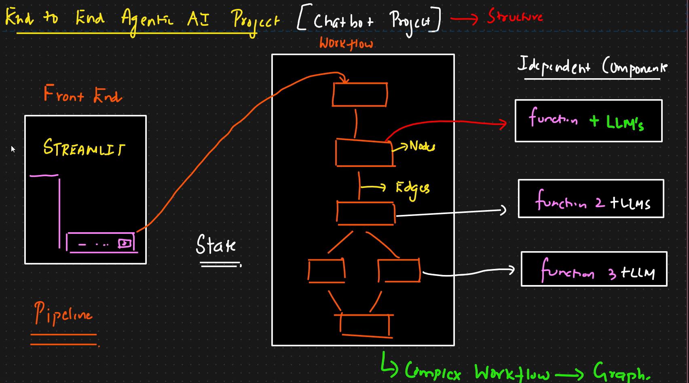

# End to End Project – Agentic AI Chatbot

## Project Overview

This project is part of an end-to-end implementation where we start by building a **basic chatbot** using modular coding practices.

As we progress, the complexity of the applications will increase:

- Basic Chatbot  
- Chatbot with Tools  
- Fetching Recent AI News  
- More complex projects using FastAPI  
- Deployment using CI/CD pipeline  

Initially, we begin with building a **basic chatbot**.

---

# Setup Environment

## 1. Create Project Workspace

First, create a dedicated project folder in your local system.

Example:

AgenticChatBot

Open Command Prompt in this folder and launch VS Code from there.

You can choose any location in your local system. All coding for this project will be done inside this project folder.

---

## 2. Create Virtual Environment

It is mandatory to create a separate environment for every project.

### Using Conda

```bash
conda create -p venv python==3.13
```

This creates a virtual environment named venv using Python 3.13.

When prompted to confirm package installation, type:

`y`

### Activate the environment:

`conda activate venv`

- Activation is case-sensitive on some systems; use the exact name you created (venv or Venv) depending on your command.

### Create requirements.txt

`requirements.txt`

### Add the libraries that will be used for this project.

```bash
langchain
langgraph
langchain-community
langchain-core
langchain-groq
langchain-openai
faiss-cpu
streamlit
python-tavily
```

- Notes:

    - langchain-groq was preferred because it is open source.

    - langchain-openai is optional.

    - tavily / Tavileh is used for internet search.

### 4. Install Dependencies

- With the virtual environment activated, run:    

```pip install -r requirements.txt```

- Wait for the installation to complete — this will install all libraries listed in requirements.txt into your virtual environment.

### GitHub Preparation

- Before committing code to GitHub, add these files to your project.

### Create .gitignore

- Create a file named:

`.gitignore`

### Create README.md

- Create the project README file:

`README.md`

- Add an initial title/description (this file will be updated with project documentation).

- Example content:

`End to End Project – Agentic AI Chatbot`


### Alternative: UV (optional)

- If you prefer the UV workflow (used later in other demos), you can initialize a workspace with:

```bash
pip3 install uv
uv init <folder_name>
uv add langgraph langchain_community langchain_core langchain_groq langchain_openai faiss_cpu streamlit tavily-python
```

# Architecture Flow Diagram

The project follows a **pipeline-based modular architecture** built around a complex workflow using LangGraph.



The architecture consists of:

1. Frontend (Streamlit)
2. Workflow (Graph)
3. Independent Components
4. State Management
5. LLM Integration

---

## High-Level Flow

Frontend (Streamlit)  
        ↓  
State Initialization  
        ↓  
Graph Execution (Complex Workflow)  
        ↓  
Nodes (Independent Functional Components)  
        ↓  
LLMs + Function Execution  
        ↓  
Response Returned to UI  

---

## Component Explanation Based on Flow Diagram

### 1️⃣ UI (Frontend)

- Built using **Streamlit**
- Allows users to:
  - Select LLM
  - Select model
  - Provide API keys
  - Select use case
  - Enter chat message
- Triggers workflow execution
- Displays final response

The UI acts as the **entry point of execution**.

---

### 2️⃣ State

- Maintains shared information across nodes
- Stores conversation context
- Accessible throughout the workflow
- Ensures consistent data flow across the graph

State acts as the **central memory layer**.

---

### 3️⃣ Graph (Complex Workflow)

- Represents the full chatbot workflow
- Built using LangGraph
- Contains:
  - Start node
  - Functional nodes
  - Conditional edges
  - End node

The graph defines:
- How nodes are connected
- Execution order
- Conditional routing logic

Complex Workflow → Graph Representation

---

### 4️⃣ Nodes

Nodes are independent functional components.

Each node:
- Contains specific logic
- Executes a defined function
- May call an LLM
- Can connect to other nodes via edges

In the diagram:
- Node → Function 1 + LLM
- Node → Function 2 + LLM
- Node → Function 3 + LLM

Each node is implemented as a separate module for modularity.

---

### 5️⃣ LLMs

- Integrated within nodes
- Can support multiple models
- Selected dynamically from UI
- Used for response generation

LLMs are not tightly coupled to the UI — they are invoked through nodes.

---

## Execution Pipeline Concept

This project does NOT execute like a Jupyter Notebook.

Instead, it runs as a structured pipeline:

1. User input from UI
2. Workflow starts at Graph Start Node
3. Execution moves across nodes via edges
4. Conditional logic determines next step
5. Functions + LLMs execute
6. End node returns final output
7. Response displayed in UI

---

## Independent Modular Components

The architecture is built using independent modules:

- Nodes
- Graph
- LLMs
- State
- Tools
- UI

Each component is isolated in its own folder and treated as a package.

This ensures:

- Clean architecture
- Reusability
- Scalability
- Maintainability
- Deployment readiness

---

## Architectural Summary

The system follows this structure:

UI (Streamlit)  
        ↓  
State  
        ↓  
Graph (Workflow Engine)  
        ↓  
Nodes (Functions + LLMs)  
        ↓  
End Node  
        ↓  
UI Response  

This design enables:

- Modular development
- Complex workflow orchestration
- LLM abstraction
- Tool integration
- Clean CI/CD deployment pipeline

---

## Next Step

After defining this structure:

- Begin implementing components step-by-step:
  1. UI
  2. Nodes
  3. LLM configuration
  4. State management
  5. Graph construction
  6. Integration through main.py

---
 
 
 # Frontend — UI (Streamlit)

- This section documents the frontend part of the project. 
- It explains purpose, responsibilities, files, and technical definitions for the Streamlit-based UI module used to drive the Agentic AI chatbot workflow.

## Overview

- The frontend is implemented using Streamlit and provides the user-facing controls to:
- select LLMs and model variants

- provide API keys
- choose use cases (Basic Chatbot, Chatbot with Tools, AI News)
- enter chat messages

- The UI triggers the backend workflow (LangGraph) by calling the modular pipeline from the selected configuration. The frontend is intentionally modular — split into configuration, loader, and display components — so the UI can be easily extended and maintained.

## Frontend Goals / Responsibilities

- Render control panel (left sidebar) containing:
        - LLM selection
        - Model selection for chosen LLM
        - API key input
        - Use-case selection
- Expose a chat/message input area
- Load constants and options from a configuration file
- Persist small UI state in session state
- Trigger workflow execution (via main.py / app.py)

## Files (UI module)

- Place all UI files under src/.../ui/streamlit/ 

- ui_config.ini — configuration file containing constants used by the UI (page title, LM options, use-case options, model lists).

- ui_config_file.py — module that reads ui_config.ini using ConfigParser and exposes getter methods (get_lm_options, get_usecase_options, get_groq_model_options, get_page_title, etc.).

- load_ui.py — contains LoadStreamlitUI class which:

        - loads configuration via Config
        - builds the Streamlit sidebar controls
        - returns a dictionary of `user_controls` (selected LLM, model, API key, use case, etc.)

- display_result.py — module responsible for rendering results / responses in the UI (kept separate to keep responsibilities modular).

- main.py — imports and uses the LoadStreamlitUI to build the UI and handle user input (connects sidebar selection → workflow trigger).

- app.py — application entry point; calls the function in main.py to start the Streamlit app.


## How the UI triggers the pipeline (brief flow)

- User selects options (LLM, model, use case) and provides API key in sidebar.
- LoadStreamlitUI returns user_controls to main.py.
- main.py shows the user message input box (Streamlit text input).
- When the user enters a message and submits:
        - `main.py` will validate required selections (e.g., API key for groq).
        - The app loads the selected LLM adapter (the LLM is configured via llms/ module, not detailed here).
        - main.py triggers the LangGraph workflow by passing the message + user_controls into the graph orchestration layer.
- The graph (nodes + edges + state) executes and returns a response.
- `display_result.py` formats and renders the response in the page.


## Implementation Guidelines

- Keep the UI modular: separate configuration, loader and renderer.
- Store all constants in ui_config.ini to avoid hard-coding values in the UI.
- Use ConfigParser for reading .ini file.
- Use select boxes for options that come from configuration (comma-separated lists).
- Persist sensitive values like API keys in st.session_state for the running session.
- Keep frontend responsibilities to UI rendering / capturing selections; backend orchestration lives in main.py and graph modules.

-----------------------------------------------

# LLM Model Integration — Groq (LangChain)

## Overview

This module is responsible for loading the selected LLM dynamically based on the **user inputs captured from the Streamlit frontend**.

The frontend collects:
- Selected LLM
- Selected model
- API key

These values are stored inside `user_controls` and passed to the LLM loader module.

This module reads those controls and initializes the corresponding LLM instance using `langchain_groq`.

---

## Objective

- Read API key from Streamlit user controls
- Read selected model from user controls
- Validate API key availability
- Initialize the Groq LLM using LangChain
- Return the LLM instance for workflow execution

---

## File Structure

```
LLMs/
└── groqllm.py

```

This file contains the class responsible for loading Groq LLM.

---

## Dependencies

The following libraries are required:

```python
import os
import streamlit as st
from langchain_groq import ChatGroq
```

- `os` → Used for environment variable handling
- `streamlit` → Used to access user controls and show errors
- `ChatGroq` → LangChain wrapper for Groq LLM

- User controls are created in: `ui/streamlit/load_ui.py`
- They include: `{ "groq_api_key": "...", "selected_groq_model": "...", ...}`
        - These controls are passed to the LLM loader class as input.

## Class Design
- Class: `GroqLLM`
- Encapsulates Groq LLM loading logic in a modular way.

## Model Loading Method
- Method: `get_llm_model()`
- Loads the Groq LLM based on:
        - API key
        - Selected model
- `if groq_api_key=='' and os.environ("GROQ_API_KEY") == '':` Why `and` condition:
- "API key must be provided via UI OR it must exist as environment variable"

| UI Key       | ENV Key      | Condition Result | Behavior  |
| ------------ | ------------ | ---------------- | --------- |
| Provided     | Not Provided | ❌ False          | ✅ Allowed |
| Not Provided | Provided     | ❌ False          | ✅ Allowed |
| Provided     | Provided     | ❌ False          | ✅ Allowed |
| Not Provided | Not Provided | ✅ True           | ❌ Error   |


-------------------------------------------------------------------

# Graph Builder Module — README

## Overview

- This module implements the **workflow / graph** layer of the End-to-End Agentic AI project.  
- After implementing the LLM loader and the Streamlit UI, the next step is to construct the graph that orchestrates nodes (functional components) and edges (control flow) to implement the chatbot use case.

- The first implemented workflow is the **Basic Chatbot**:

```bash
Start → Chatbot Node → End
```

- Nodes contain behavior (take input, call the LLM, produce a response). 
- The graph orchestrates node execution and shares data via a centralized state.

---

## Goals & Responsibilities

- Build a **GraphBuilder** that can programmatically assemble the workflow graph.
- Initialize and attach the loaded LLM to the graph execution context.
- Initialize and provide the **state** object that is shared across nodes.
- Define node registration (add_node) and edges (add_edge) for Start → Node → End flows.
- Keep node implementations modular in the `nodes/` folder (e.g., `basic_chatbot_node.py`) so each use case can be added independently.

---

## File Organization 

```
src/
└── landgraf_agentic_ai/
    └──graph/
    │  └── graph_builder.py # GraphBuilder class (this module)
    ├── state/
    │   ├── init.py
    │   └── state.py # State Pydantic/type definitions & reducers
    ├── nodes/
    │   ├── init.py
    │   └── basic_chatbot_node.py # Basic chatbot node implementation
    ├── llms/
    │   └── grok_lm.py # (already implemented)
    ├── ui/
    │   └── ... # Streamlit UI modules
    └── main.py # Orchestration entry (calls GraphBuilder)
```


---

## Key Concepts & Definitions

### Graph
- A representation of the workflow composed of **nodes** (functional units) and **edges** (connections / control flow).
- For the basic chatbot graph: `Start → Chatbot → End`.

### Node
- Encapsulates a discrete operation (e.g., receive input, call LLM, format response).
- Implemented as independent modules under `nodes/`.
- Node functions accept inputs (including state and LLM) and return outputs or update shared state.

### Edge
- A directed connection between nodes that determines execution order.
- May be conditional (if/else routing) in more complex workflows.

### State
- A shared, structured object accessible to all nodes during graph execution.
- Used to preserve conversation context, messages, metadata between nodes.
- Typically implemented using typed structures (Pydantic models or typed dicts) and reducers to append/modify state safely.

---

## `state/state.py` (technical definition)

- Purpose: define the structure of the state object shared by the graph and nodes.
- Suggested:

```python
  from typing_extensions import TypedDict,List
  from typing import Annotated
  from collections import deque
  # Optional: from pydantic import BaseModel (if using Pydantic)
  from langgraph.graph.message import add_messages
```

- `message` is a list (or deque) that reducers append to (not replace).
- Reducers (imported from LangGraph utilities) will append messages into the state.
- It emphasizes using typed structures and reducers so that state updates append instead of replacing lists.

## `graph_builder.py` — GraphBuilder

### Purpose

- Create and own the graph instance.
- Accept the already-loaded LLM model and the state object.
- Register nodes and edges to construct the workflow.
- Provide an API like build_basic_chatbot() to create the Start → Chatbot → End graph.

### Key responsibilities 

- `__init__(self, model)`
        - `self.llm = model` (LM passed when graph execution is triggered)
        - `self.graph_builder = <state_graph_instance>` (initialize the graph object)
        - Initialize or import the shared state class and instantiate state for the graph.

- Create the state graph instance and bind state:
        - Import state_graph, start, end.
        - Create the state instance from state/state.py and associate it with the graph builder.

- Provide graph-building methods:
        - `basic_chatbot_build_graph(self)` — method to build the simple chatbot graph:
        - Add nodes: `self.graph_builder.add_node("chatbot", functionality=...)`
        - Add edges: 
                - `self.graph_builder.add_edge(START, "chatbot")`
                - `self.graph_builder.add_edge("chatbot", END)`

- Node integrations:
        - The node functionality is implemented in `nodes/basic_chatbot_node.py`.
        - GraphBuilder registers the node (by name/identifier) and the associated function.

- `nodes/basic_chatbot_node.py` 

- Purpose: implement the chatbot node logic (accept user input, call LLM, update state, return response).
- Minimal chatbot node should:
        - Accept input (prompt/message)
        - Use the loaded LM to generate a response
        - Append messages to the state (using reducers)
        - Return or store the response to be read by the graph’s End node

## How GraphBuilder & Nodes are Wired (execution flow)

- Front-end collects user input and selected model (UI → `user_controls`).
- LLM loader (e.g., `GroqLLM`) initializes the model instance and returns it.
- GraphBuilder is instantiated with that LLM:
        - `graph_builder` = `GraphBuilder(model=llm)`
- GraphBuilder initializes the graph and state, and then calls a build method:
        - `graph_builder.basic_chatbot_build_graph()`
- Main orchestration triggers the graph execution (e.g., `graph_builder.execute(start_payload)`), which:
        - Sends the input to the start node
        - Graph traverses edges to the chatbot node
        - Chatbot node calls LM and updates the shared state
        - End node finalizes execution and returns output
- Main or a `display_result` module renders the response in the UI.

## Summary

- The Graph Builder module constructs the execution graph for chatbot workflows.
- It accepts a loaded LLM and a state object, registers nodes and edges, and provides methods to build use-case graphs (starting with the Basic Chatbot).
- Node implementations live in `nodes/` and should be modular and simple: take input, call the LM, update shared state, and return responses.
- The graph + state + LLM combination enables pipeline-style execution (Start → Node(s) → End) rather than ad-hoc notebook-style runs.
-------------------------------------------------------------------

# Node Implementation Module

## Overview

- This module implements the **node definitions** for the Basic Chatbot workflow in the End-to-End Agentic AI project.  

- The graph orchestration is built with :contentReference[oaicite:0]{index=0}, and the UI is driven by :contentReference[oaicite:1]{index=1}.  

- We have already:
        - Implemented the Graph Builder and created a simple Basic Chatbot graph (`Start → Chatbot → End`)  
        - Implemented the LLM loader (Gro1 or other LLMs)  
        - Built the Streamlit UI to collect `user_controls`

- This Node Implementation module completes the loop by providing the chatbot node logic that:
        - Accepts input (from state)
        - Invokes the loaded LLM
        - Updates shared state
        - Returns the response to the graph / UI

## Goals & Responsibilities

- Implement a **BasicChatbotNode** class that encapsulates chatbot behavior.
- Provide a `process(state: State) -> dict` method (returns a dict) that:
  - Reads conversation input from the shared `state`
  - Calls the loaded LLM to generate a response
  - Appends/updates the `state` with the new message(s)
  - Returns output (usually the messages) for downstream consumption
- Ensure the node is modular and easily reusable by the GraphBuilder.

---

## File Location:
```
src/
└── landgraf_agentic_ai/
    └──graph/
    │  ├── init.py
    │  └── graph_builder.py       # GraphBuilder wires nodes into the graph
    ├── state/
    │   ├── init.py
    │   └── state.py              # Shared state definition (message list, reducers)
    ├── nodes/
    │   ├── init.py
    │   └── basic_chatbot_node.py # Node implementation (this module)
    ├── llms/
    │   ├── init.py
    │   └── grok_lm.py            # LLM loader (already implemented)
    ├── ui/
    │   └── streamlit/ # Streamlit UI modules (load_ui.py etc.)
    └── main.py # Orchestration entry (calls GraphBuilder)
```


---

## Class: `BasicChatbotNode`

### Purpose
Encapsulate the minimal chatbot logic used by the graph node: use the lLM to reply to messages stored in `state`.

### Constructor

```python
def __init__(self, model):
    self.lm = model
```


- `model` is the already-loaded LLM instance passed from the GraphBuilder (e.g., `GroqLLM.get_models()` result).

- Store the model on the node instance for use in `process()`.

## Method: `process(self, state:State) -> dict:`

- Inputs:
        - `state` — the shared state object which contains `messages` (a list or deque).

- Behavior:
        - Read the conversation/messages from state (the messages field).
        - Invoke the LM with the state.messages as input (example: self.lm.invoke(state.messages)).
        - Receive the LM response.
        - Append the response to state.messages (use reducers if available so updates append rather than replace).
        - Return the messages (or a dict containing the new messages) so the graph/end node can use them.
- Return `type: dict` (returning in dictionary form; keyed by `messages`).
- The node is simple: it takes input (from state) and returns a response by invoking the LLM.

## How the Node Is Registered with GraphBuilder:

- In `graph_builder.py`, after creating the graph and initializing self.llm, the `BasicChatbotNode` is imported and instantiated:

```python
from src.langgraphagenticai.nodes.basic_chatbot_node import BasicChatbotNode
self.basic_chatbot_node = BasicChatbotNode(self.llm)
```

- When building the basic chatbot graph (`basic_chatbot_build_graph()`), the node is registered and wired:

```python
self.graph_builder.add_node("chatbot", func=self.basic_chatbot_node.process)
self.graph_builder.add_edge(START, "chatbot")
self.graph_builder.add_edge("chatbot", END)
```

- During execution the graph calls chatbot node's process(state) using the shared state and the node returns the response.

## State Interaction:

- state is defined in `src/landgraf_agentic_ai/state/state.py` and contains a `messages` collection (list / deque).

- Node updates should **append** to `messages`. The reducers append-only updates the list (not replacement).

- Always pass `state` into `process()` so node can read and mutate shared conversation context.

## Error Handling & Validation

- Nodes should assume the LLM is already loaded by the time `process` is called (GraphBuilder passes the LLM to node during initialization).

- Node implementations should include minimal exception handling around LLM invocation to raise clear errors if LLM calls fail (e.g., catch exceptions and raise a ValueError or return an error message in the output dict).

## Execution Flow (end-to-end recap)

- **UI** collects `user_controls` (selected LLM, model, API key, message).
- **LLM loader** initializes the model and returns an LLM instance.
- **GraphBuilder** is instantiated with the LM and state.
- **GraphBuilder** registers nodes (including `BasicChatbotNode`) and edges.
- **Main** triggers graph execution on user input:
        - Graph invokes the `chatbot` node's `process(state)`
        - Node calls LLM, updates `state.messages`, returns messages
        - End node finalizes execution; `display_result` renders output in UI
-------------------------------------------------------------------